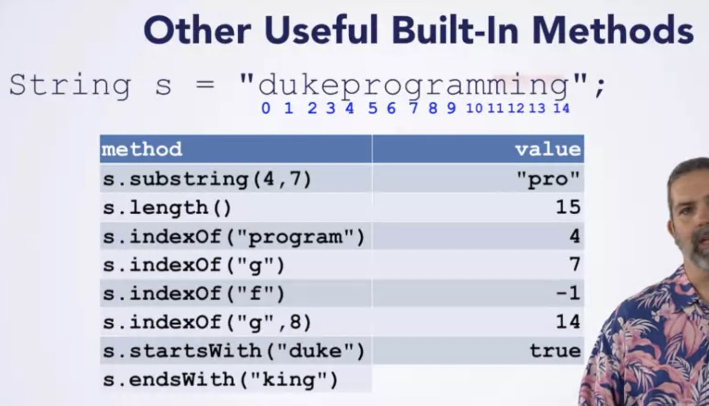

# Object-Oriented-Programming-in-Java
#### Provided by Duke University (on Coursera)  
course resources:  
https://www.dukelearntoprogram.com//course2/index.php

---- 
### Week 1:   
Quiz 1: Getting Started with BlueJ   

    - what you need to do in order to run the program?  
      1. compile the program 2. create a new object for the class 3. call the method  
    
    - What happends when one compiles a Java program in BlueJ on ther computer?
      The .java file is translated into a .class file that can be run on that computer
    
    - What is BlueJ
      A programming environment
&nbsp;

High level concepts:

> - Data: store the values you are computing on
>  - Code: when it manipulates that data according to the algorithm you have designed.
>  - OOP: a paradigm of programming languages that groups data, and the
> code that manipulates it, together into logical units called objects.
> 
>       (Object = Data + Code)

&nbsp;

Primitives and Objects  
    
    - Primitives: int, double, char, boolean, float, long, byte, short
        - value is directly in box
        - Can't invoke methods on them
        - Can't be null (but can use wrapper class)
    
    - Objects: String, Point, Shape, any class you write yourself
        - Reference to object
        - Can invoke methods, access fields with dot
        - Can be null
        - == checks if arrows point at some object
&nbsp;

Quiz 4: Classes, Types, and For Each Loops  
    
    - Only variabled declared outside the methods are instance variables
&nbsp;

:facepunch: Solving Programming: A Seven Step Approach

> - Work Example By Hand
> - Write Down What You Did
> - Find Patterns
> - Check By Hand
> - Translate To Code
> - Run Test Cases
> - Debug Failed Test Cases
&nbsp;

---- 
### Week 2:  
Some Useful Built-In Methods for String
    

